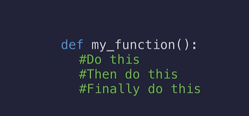
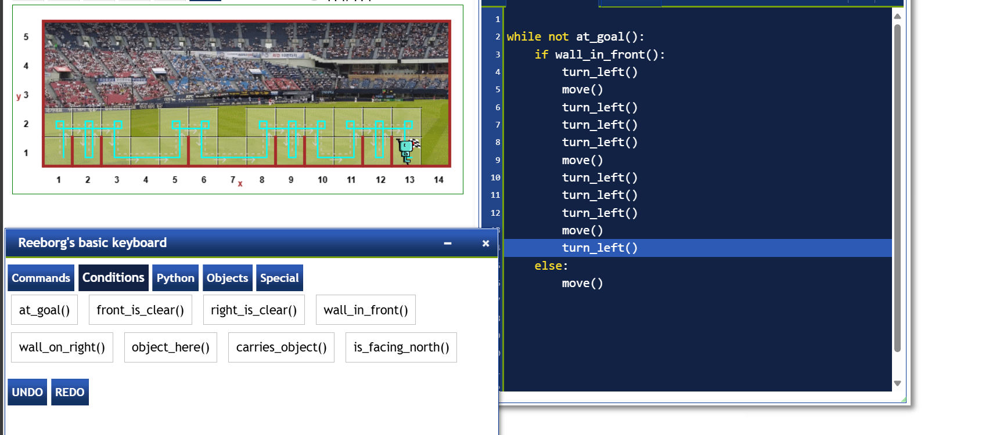
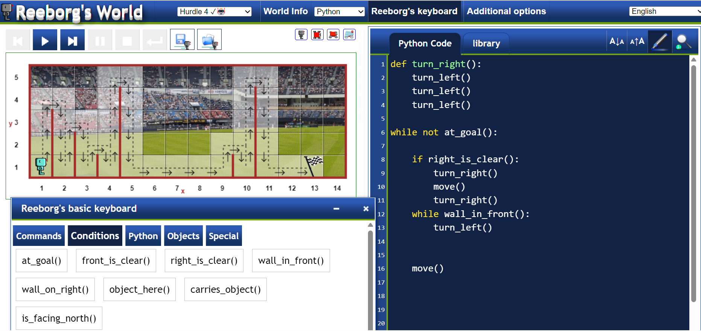
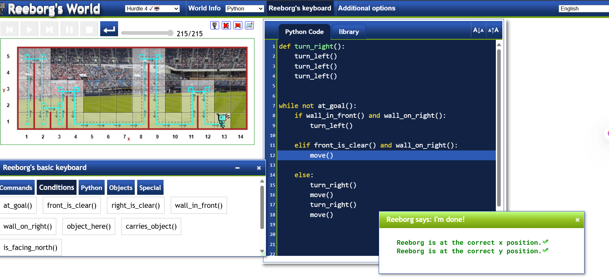
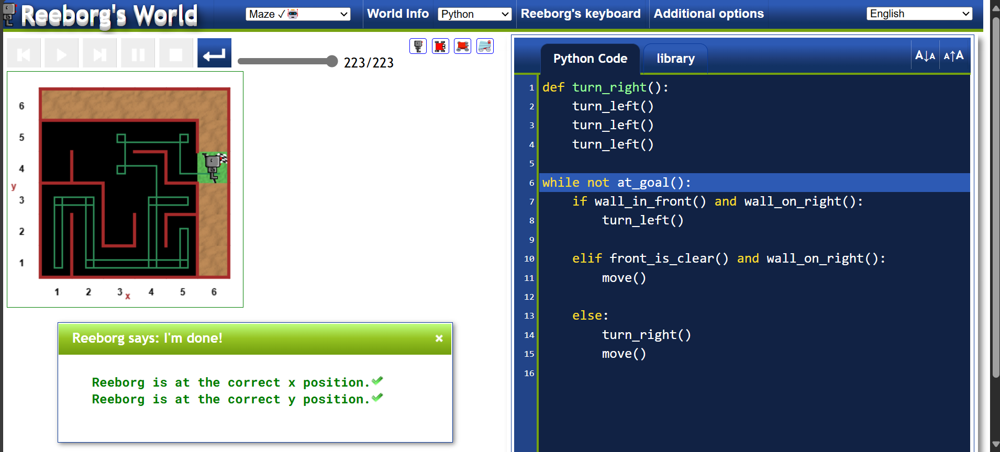

## PLaying with Reeborg game
https://reeborg.ca/reeborg.html?lang=en&mode=python&menu=worlds%2Fmenus%2Freeborg_intro_en.json&name=Hurdle%201&url=worlds%2Ftutorial_en%2Fhurdle1.json

## Defining a function 


# Exercise 



# Exercise 


# Another way of solving it



# Final Exercise 



```
def turn_right():
    turn_left()
    turn_left()
    turn_left()

while not at_goal():
    if wall_in_front() and wall_on_right():
        turn_left()
    
    elif front_is_clear() and wall_on_right():
        move()
    
    else:
        turn_right()
        move()
```