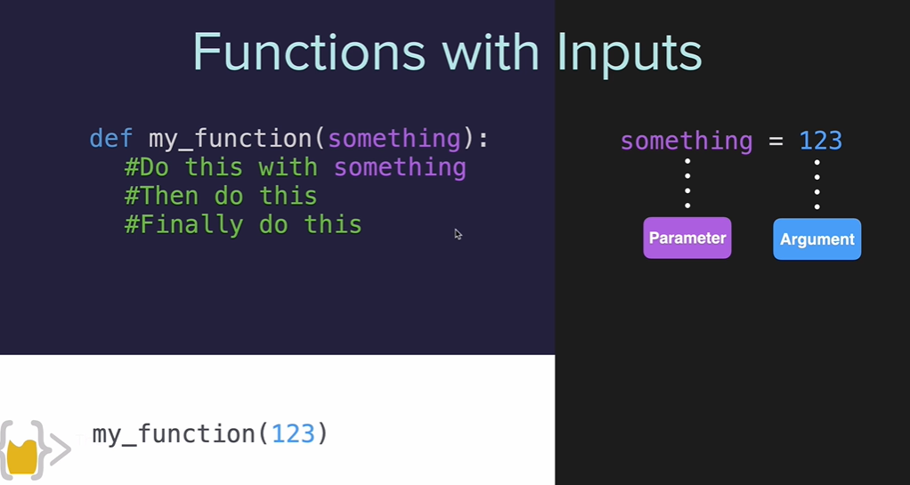

## Diference between parameter and argument

the parameter is the name of the data, the argument is the actual value of the data

```bash
name=input("tell me what is your name")
location=input("where are you?")
def greet(name, location):
  print(f"hi {name}")
  print(f"how is it going {name} in {location}?")
  print(f"have a nice day {name}")
greet(name, location)
#the order matters when using positional arguments

greet(location,name)

```

## using keywords argument

```bash
def greet(name, location):
  print(f"hi {name}")
  print(f"how is it going {name} in {location}?")
  print(f"have a nice day {name}")
greet(name="jane", location="Berlin")
#the order doesn't matte when using keyword argument
greet(location="Berlin", name="jane", )
```